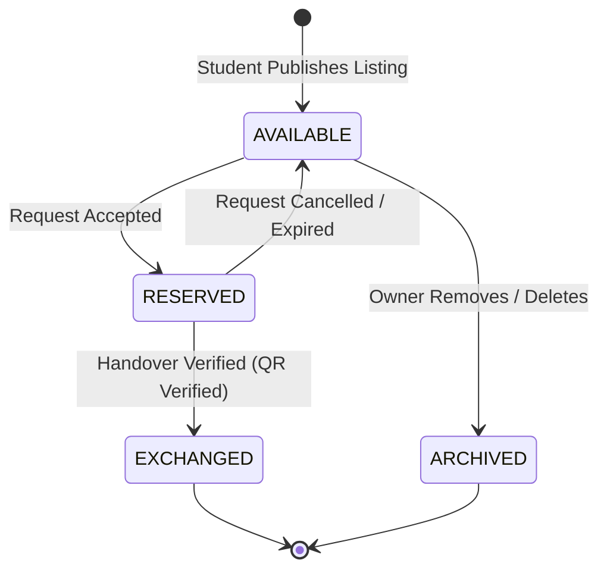
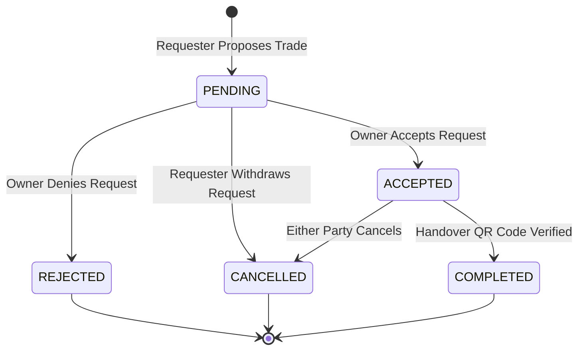

# ResourceHub Database Design

This document details the relational database design for **ResourceHub**, a campus-focused resource exchange platform. The database runs on **MySQL** and conforms to standard relational database principles up to Third Normal Form (3NF).

---

## 1. Database Schema Overview

The database comprises 10 core tables designed to track user roles, resource items, categories, images, exchange transactions, QR codes, rating reviews, wishlist items, notifications, and moderation reports.

### Table Descriptions & Schema Details

#### A. `users`
Represents verified students and platform administrators.
- **Purpose**: Stores student campus profiles and verification credentials.
- **Primary Key**: `id` (INT AUTO_INCREMENT)
- **Columns**:
  - `name`: Student name (e.g. "Alex Rivera").
  - `email`: Verified college email ending in academic domain (`UNIQUE`).
  - `password_hash`: Cryptographically hashed password (designed for a standard 60-character bcrypt hash).
  - `trust_score`: Rating calculated dynamically from trade reviews, starting at `100.00`.
  - `role`: Specifies permissions (`STUDENT` or `ADMIN`).
  - `status`: Account lifecycle state (`PENDING_VERIFICATION`, `ACTIVE`, `SUSPENDED`).
- **Constraints**:
  - `CHECK (email LIKE '%@%.%')` (forces standard email format validation).

#### B. `categories`
Stand-alone dictionary to categorize items.
- **Purpose**: Allows administration to create or manage catalog classifications.
- **Primary Key**: `id` (INT AUTO_INCREMENT)
- **Columns**:
  - `name`: Category label (`UNIQUE`, e.g. "Laboratory Equipment").
  - `slug`: URL-friendly name representation (`UNIQUE`, e.g. "laboratory-equipment").

#### C. `resources`
Active listings posted by students.
- **Purpose**: Tracks catalog items offered by campus students.
- **Primary Key**: `id` (INT AUTO_INCREMENT)
- **Foreign Keys**:
  - `owner_id` references `users(id)` (restricts deletion of active users).
  - `category_id` references `categories(id)` (restricts deletion of active categories).
- **Columns**:
  - `exchange_type`: Methods (`SELL`, `BORROW`, `DONATE`, `SWAP`).
  - `price`: Item listing price, nullable, used only for `SELL` type.
  - `item_condition`: Condition (`NEW`, `LIKE_NEW`, `GOOD`, `FAIR`, `POOR`).
  - `status`: Availability indicator (`AVAILABLE`, `RESERVED`, `EXCHANGED`, `ARCHIVED`).
- **Constraints**:
  - `CHECK (price >= 0.00)` (no negative pricing).
  - `CHECK (exchange_type != 'SELL' OR price IS NOT NULL)` (forces price declaration when selling).

#### D. `resource_images`
Supports multiple images per resource listing.
- **Purpose**: Stores image URLs rather than storing heavy binary images directly in MySQL.
- **Primary Key**: `id` (INT AUTO_INCREMENT)
- **Foreign Keys**:
  - `resource_id` references `resources(id)` (cascade delete cleans up images when resource is removed).

#### E. `exchange_requests` (Transactions)
Tracks student exchange workflows.
- **Purpose**: Records requested swaps, borrows, donations, or purchases.
- **Primary Key**: `id` (INT AUTO_INCREMENT)
- **Foreign Keys**:
  - `resource_id` references `resources(id)`.
  - `requester_id` references `users(id)`.
  - `offered_resource_id` references `resources(id)` (nullable, points to requester's item for `SWAP` requests).
- **Columns**:
  - `status`: Lifecycle indicators (`PENDING`, `ACCEPTED`, `REJECTED`, `CANCELLED`, `COMPLETED`).
  - `borrow_duration_days`: Duration limit in days, nullable, used for `BORROW` requests.
  - `price_agreed`: Capture agreed pricing at time of checkout for sustainability audit logs.
- **Constraints**:
  - `CHECK (borrow_duration_days > 0)`.

#### F. `qr_verifications`
Secures physical handovers.
- **Purpose**: Authenticates in-person campus exchanges without storing sensitive tokens in QR codes.
- **Primary Key**: `id` (INT AUTO_INCREMENT)
- **Foreign Keys**:
  - `transaction_id` references `exchange_requests(id)` (`UNIQUE` - 1 verification code record per transaction).
  - `verified_by_id` references `users(id)` (tracks the scanner user ID).
- **Columns**:
  - `verification_token`: Secure high-entropy random hash (e.g. SHA256) (`UNIQUE`).
  - `status`: QR code validity indicator (`GENERATED`, `VERIFIED`, `EXPIRED`).
  - `expires_at`: Verification validity duration timestamp.

#### G. `reviews`
Peer-to-peer ratings system.
- **Purpose**: Allows users to rate each other after completed exchanges.
- **Primary Key**: `id` (INT AUTO_INCREMENT)
- **Foreign Keys**:
  - `transaction_id` references `exchange_requests(id)`.
  - `reviewer_id` references `users(id)`.
  - `reviewed_id` references `users(id)`.
- **Columns**:
  - `rating`: Star values between `1` and `5`.
  - `review_text`: Optional textual feedback.
- **Constraints**:
  - `CHECK (rating BETWEEN 1 AND 5)`.
  - `UNIQUE KEY (transaction_id, reviewer_id)` (prevents duplicate ratings for a completed trade).

#### H. `notifications`
Dispatches event alerts to students.
- **Purpose**: Holds unread/read alert logs.
- **Primary Key**: `id` (INT AUTO_INCREMENT)
- **Foreign Keys**:
  - `recipient_id` references `users(id)` (cascade delete removes alerts when user is purged).

#### I. `wishlist`
Bookmarks saved resources.
- **Purpose**: Allows students to track items they want.
- **Primary Key**: Composite key `(user_id, resource_id)`.
- **Foreign Keys**:
  - `user_id` references `users(id)` (cascade delete).
  - `resource_id` references `resources(id)` (cascade delete).

#### J. `reports`
Campus safety moderation.
- **Purpose**: Lets students flag suspicious users, items, or mock transactions.
- **Primary Key**: `id` (INT AUTO_INCREMENT)
- **Foreign Keys**:
  - `reporter_id` references `users(id)`.
- **Columns**:
  - `reported_entity_type`: Flag types (`USER`, `RESOURCE`, `TRANSACTION`).
  - `reported_entity_id`: ID reference matching entity type.
  - `status`: Admin workflow state (`PENDING`, `UNDER_REVIEW`, `RESOLVED`, `DISMISSED`).

---

## 2. Indexing Strategy

To maintain performance as listings and users scale, the following indexes are declared in [`schema.sql`](file:///c:/Projects/ResourceHub/database/schema.sql):

1. **`users(email)`**: Fast email lookups during student authentication.
2. **`resources(status, category_id)`**: Optimizes marketplace search filtering.
3. **`resources(owner_id)`**: Speeds up student dashboard active listing counts.
4. **`exchange_requests(requester_id)` & `exchange_requests(resource_id)`**: Speeds up transaction history queries.
5. **`notifications(recipient_id, is_read)`**: Accelerates notification badge counts.
6. **`reports(status)`**: Speeds up admin dashboard moderation queues.

---

## 3. Core System Lifecycles

### Resource Lifecycle

### Exchange Request Lifecycle

---

## 4. Secure QR Verification Flow

The QR system verifies face-to-face handovers on campus without storing secrets inside the QR code image.

### Step-by-Step Handover Protocol
1. **Transaction Acceptance**: The owner accepts a request. The transaction enters `ACCEPTED` status.
2. **Token Generation**: The system generates a cryptographically secure random token (e.g. 64-character hex string) in `qr_verifications` with `status = 'GENERATED'` and an expiry of 1 hour.
3. **QR Display**: The requester displays a QR code containing the secure URL token on their smartphone (no user details or sensitive IDs are encoded inside the QR).
4. **Scan**: The owner scans the QR code using their camera/browser.
5. **Verification Request**:
   - The owner's browser queries the backend with the token.
   - The backend validates:
     - Token exists.
     - Token is not expired.
     - Owner ID matches the resource listing owner.
6. **State Updates**:
   - `qr_verifications` status updates to `VERIFIED` and logs the scanning timestamp.
   - `exchange_requests` status updates to `COMPLETED`.
   - The listed `resources` status transitions from `RESERVED` to `EXCHANGED`.
   - The system triggers notification dispatches to prompt both students to submit peer ratings and trust reviews.

---

## 5. Sustainability Metrics Calculation

To avoid storing duplicate summary calculations, sustainability analytics are computed dynamically using standard query functions:
- **Number of exchanges**: `SELECT COUNT(*) FROM exchange_requests WHERE status = 'COMPLETED';`
- **Reuse counts**: `SELECT resource_id, COUNT(*) FROM exchange_requests WHERE status = 'COMPLETED' GROUP BY resource_id;`
- **Students benefited**: `SELECT COUNT(DISTINCT requester_id) FROM exchange_requests WHERE status = 'COMPLETED';`
- **Money saved**: `SELECT SUM(price_agreed) FROM exchange_requests WHERE status = 'COMPLETED' AND price_agreed IS NOT NULL;` (compared to retail estimates, or using category weight offsets).
