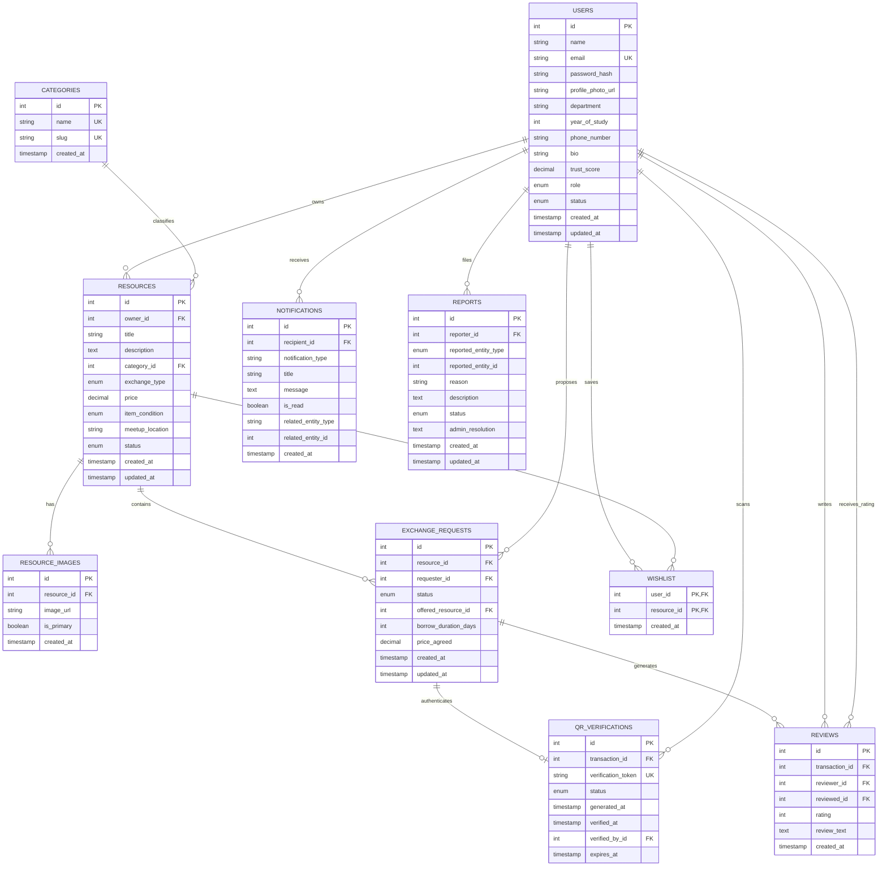

# ResourceHub Entity Relationship Diagram

The following Mermaid ER Diagram models the entities, fields, relationships, and foreign keys defined in the ResourceHub database schema.

```mermaid
erDiagram
    USERS {
        int id PK
        string name
        string email UK
        string password_hash
        string profile_photo_url
        string department
        int year_of_study
        string phone_number
        string bio
        decimal trust_score
        enum role
        enum status
        timestamp created_at
        timestamp updated_at
    }
    CATEGORIES {
        int id PK
        string name UK
        string slug UK
        timestamp created_at
    }
    RESOURCES {
        int id PK
        int owner_id FK
        string title
        text description
        int category_id FK
        enum exchange_type
        decimal price
        enum item_condition
        string meetup_location
        enum status
        timestamp created_at
        timestamp updated_at
    }
    RESOURCE_IMAGES {
        int id PK
        int resource_id FK
        string image_url
        boolean is_primary
        timestamp created_at
    }
    EXCHANGE_REQUESTS {
        int id PK
        int resource_id FK
        int requester_id FK
        enum status
        int offered_resource_id FK
        int borrow_duration_days
        decimal price_agreed
        timestamp created_at
        timestamp updated_at
    }
    QR_VERIFICATIONS {
        int id PK
        int transaction_id FK
        string verification_token UK
        enum status
        timestamp generated_at
        timestamp verified_at
        int verified_by_id FK
        timestamp expires_at
    }
    REVIEWS {
        int id PK
        int transaction_id FK
        int reviewer_id FK
        int reviewed_id FK
        int rating
        text review_text
        timestamp created_at
    }
    NOTIFICATIONS {
        int id PK
        int recipient_id FK
        string notification_type
        string title
        text message
        boolean is_read
        string related_entity_type
        int related_entity_id
        timestamp created_at
    }
    WISHLIST {
        int user_id PK, FK
        int resource_id PK, FK
        timestamp created_at
    }
    REPORTS {
        int id PK
        int reporter_id FK
        enum reported_entity_type
        int reported_entity_id
        string reason
        text description
        enum status
        text admin_resolution
        timestamp created_at
        timestamp updated_at
    }

    USERS ||--o{ RESOURCES : "owns"
    CATEGORIES ||--o{ RESOURCES : "classifies"
    RESOURCES ||--o{ RESOURCE_IMAGES : "has"
    RESOURCES ||--o{ EXCHANGE_REQUESTS : "contains"
    USERS ||--o{ EXCHANGE_REQUESTS : "proposes"
    EXCHANGE_REQUESTS ||--o| QR_VERIFICATIONS : "authenticates"
    USERS ||--o{ QR_VERIFICATIONS : "scans"
    EXCHANGE_REQUESTS ||--o{ REVIEWS : "generates"
    USERS ||--o{ REVIEWS : "writes"
    USERS ||--o{ REVIEWS : "receives_rating"
    USERS ||--o{ NOTIFICATIONS : "receives"
    USERS ||--o{ WISHLIST : "saves"
    RESOURCES ||--o{ WISHLIST : "saved_by"
    USERS ||--o{ REPORTS : "files"
```
