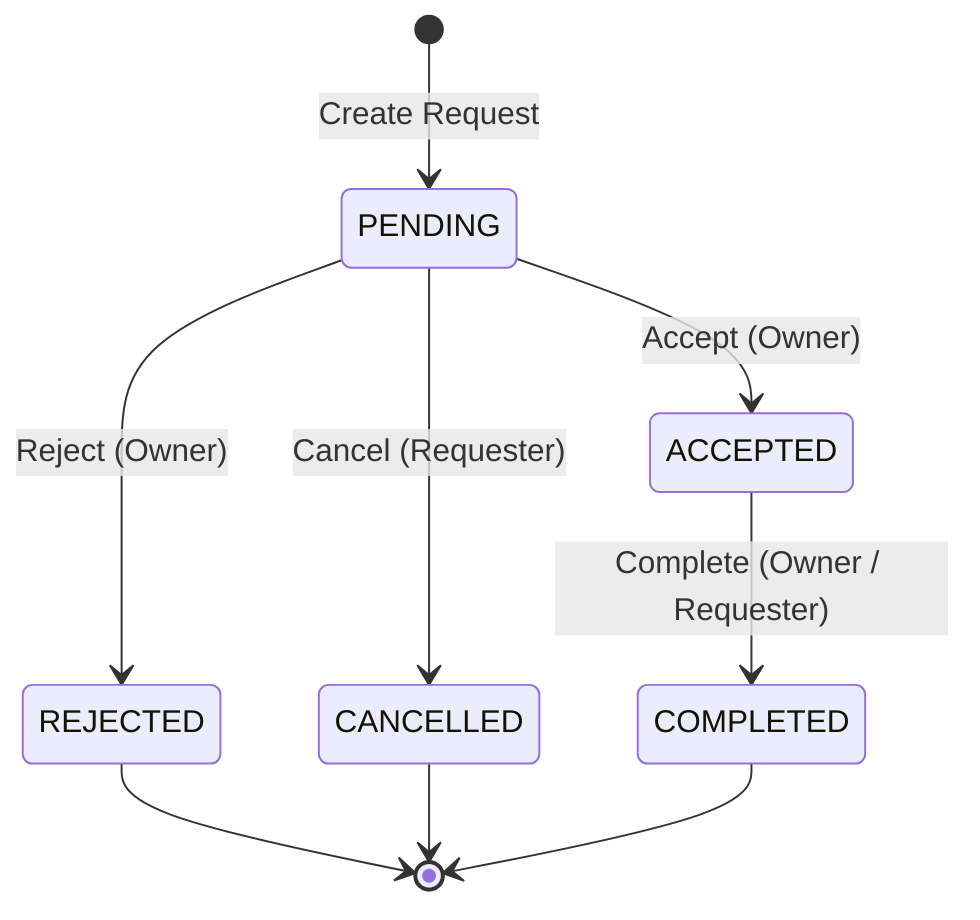

# Exchange Requests & Transaction Management Specification

This document defines the REST API endpoints, status transitions, database transaction requirements, and validation rules for ResourceHub resource exchange requests.

---

## 1. Database Table Structure
We utilize the pre-existing, normalized MySQL `exchange_requests` table:

```sql
CREATE TABLE exchange_requests (
    id INT AUTO_INCREMENT PRIMARY KEY,
    resource_id INT NOT NULL,
    requester_id INT NOT NULL,
    status ENUM('PENDING', 'ACCEPTED', 'REJECTED', 'CANCELLED', 'COMPLETED') NOT NULL DEFAULT 'PENDING',
    offered_resource_id INT NULL, -- FK for SWAP items owned by requester
    borrow_duration_days INT NULL, -- Applicable for BORROW requests
    price_agreed DECIMAL(10,2) NULL, -- Snapshots agreed price for historical sustainability auditing
    created_at TIMESTAMP DEFAULT CURRENT_TIMESTAMP,
    updated_at TIMESTAMP DEFAULT CURRENT_TIMESTAMP ON UPDATE CURRENT_TIMESTAMP,
    
    FOREIGN KEY (resource_id) REFERENCES resources(id) ON DELETE RESTRICT ON UPDATE CASCADE,
    FOREIGN KEY (requester_id) REFERENCES users(id) ON DELETE RESTRICT ON UPDATE CASCADE,
    FOREIGN KEY (offered_resource_id) REFERENCES resources(id) ON DELETE SET NULL ON UPDATE CASCADE
);
```

---

## 2. API Endpoint Specifications

All endpoints require a valid JWT Session token passed via the HTTP `Authorization: Bearer <token>` header.

### 1. Create Request (`POST /api/exchange-requests`)
- **Access**: Protected (Requester)
- **Body Options**:
  - `resource_id` (Required)
  - `borrow_duration_days` (Required ONLY if resource type is `BORROW`)
  - `offered_resource_id` (Required ONLY if resource type is `SWAP`)
- **Validations**:
  - Verifies requested resource is `AVAILABLE` and belongs to another user.
  - If type is `SELL`, `price_agreed` is automatically snapshotted from resource price (protecting history against future owner modifications).
  - If type is `BORROW`, checks `borrow_duration_days > 0`.
  - If type is `SWAP`, checks offered item is owned by requester, is `AVAILABLE`, and is not the requested resource itself.
  - Rejects duplicate pending requests.

### 2. Get Requests (`GET /api/exchange-requests`)
- **Access**: Protected (Owner/Requester)
- **Query Parameters**:
  - `status`: Filter by status (`PENDING`, `ACCEPTED`, etc.)
  - `role`: Filter by relation (`owner` to see incoming requests, `requester` to see sent requests)
- **Response**: Returns requests list joined with item and participant names.

### 3. Get Request by ID (`GET /api/exchange-requests/:id`)
- **Access**: Protected (Participants only)
- Returns detailed request context. Blocks access with `403 Forbidden` for non-participants.

### 4. Cancel Request (`PUT /api/exchange-requests/:id/cancel`)
- **Access**: Protected (Requester only)
- Cancels `PENDING` request. Updates status to `CANCELLED`.

### 5. Accept Request (`PUT /api/exchange-requests/:id/accept`)
- **Access**: Protected (Resource owner only)
- **Database Transaction (Atomicity Guard)**:
  - Updates request status to `ACCEPTED`.
  - Updates resource status to `RESERVED`.
  - If type is SWAP, also updates offered resource status to `RESERVED`.

### 6. Reject Request (`PUT /api/exchange-requests/:id/reject`)
- **Access**: Protected (Resource owner only)
- Rejects `PENDING` request. Status updates to `REJECTED`. Resource remains `AVAILABLE`.

### 7. Complete Request (`PUT /api/exchange-requests/:id/complete`)
- **Access**: Protected (Owner or Requester)
- **Database Transaction (Atomicity Guard)**:
  - Updates request status to `COMPLETED`.
  - Updates resource status to `EXCHANGED`.
  - If type is SWAP, also updates offered resource status to `EXCHANGED`.

---

## 3. Status Transitions Lifecycle

The platform enforces strict state transition pathways:



- Any attempt to bypass this progression (e.g. going from `REJECTED` -> `ACCEPTED` or `CANCELLED` -> `COMPLETED`) returns `400 Bad Request`.

---

## 4. Resource Status Mappings

Resource listings move through these states automatically upon transaction step updates:
- **`AVAILABLE`**: Initial status. Ready for exchange proposals.
- **`RESERVED`**: Set when request is accepted. Item is locked.
- **`EXCHANGED`**: Set when transaction is completed. Final historical stage.
